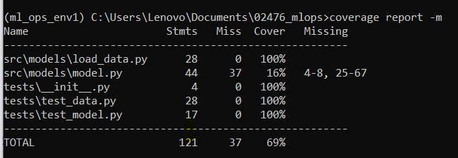
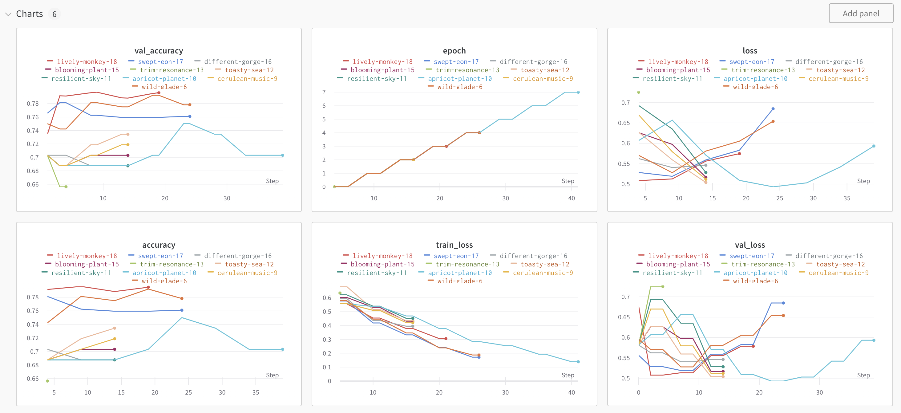
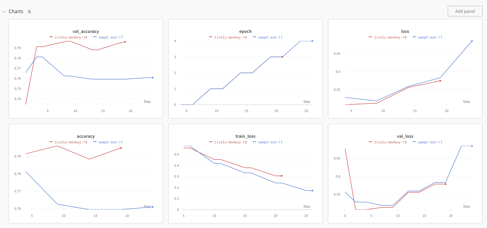
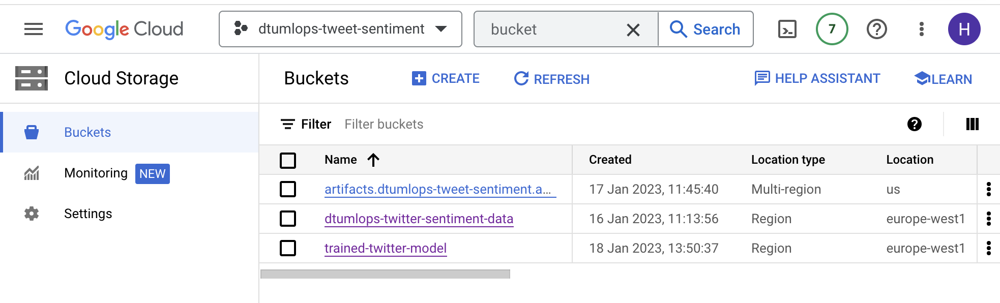
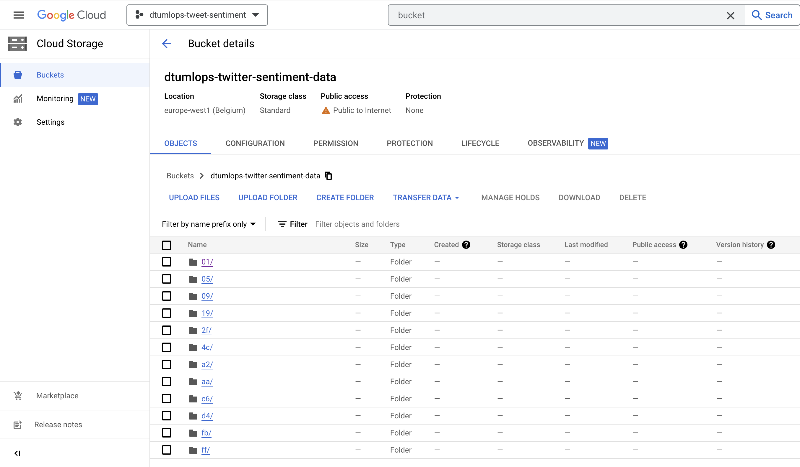
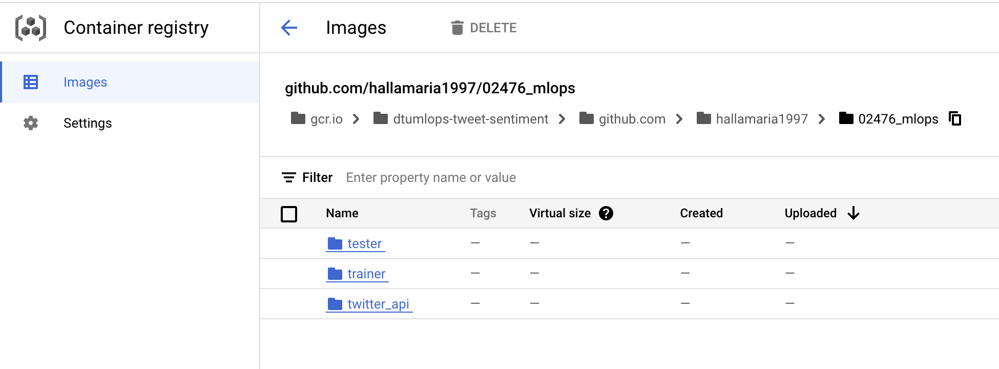
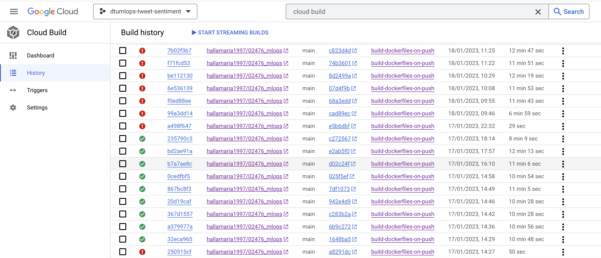
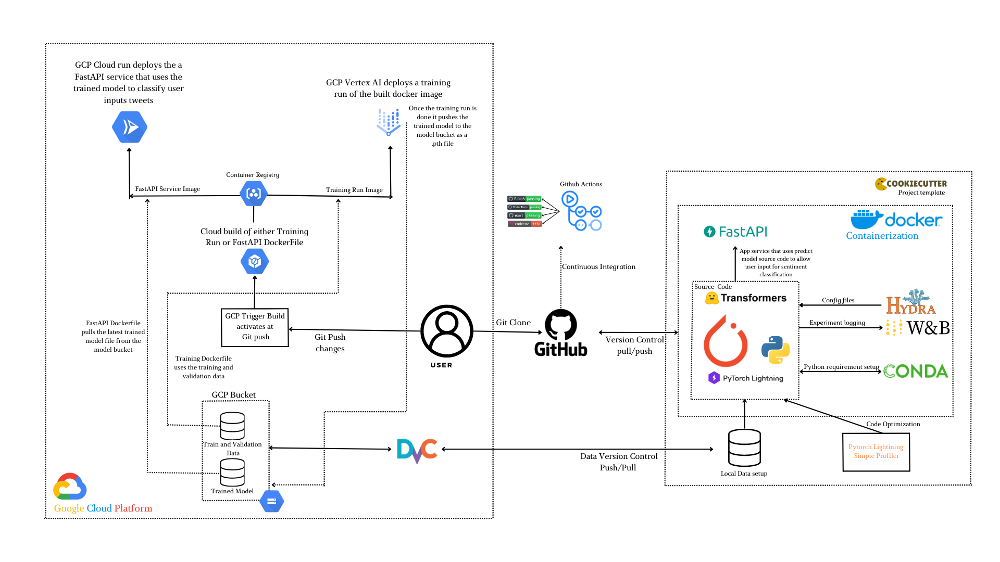

# Exam template for 02476 Machine Learning Operations

This is the report template for the exam. Please only remove the text formatted as with three dashes in front and behind
like:

```--- question 1 fill here ---```

where you instead should add your answers. Any other changes may have unwanted consequences when your report is auto
generated in the end of the course. For questions where you are asked to include images, start by adding the image to
the `figures` subfolder (please only use `.png`, `.jpg` or `.jpeg`) and then add the following code in your answer:

```markdown

```

In addition to this markdown file, we also provide the `report.py` script that provides two utility functions:

Running:

```bash
python report.py html
```

will generate an `.html` page of your report. After deadline for answering this template, we will autoscrape
everything in this `reports` folder and then use this utility to generate an `.html` page that will be your serve
as your final handin.

Running

```bash
python report.py check
```

will check your answers in this template against the constrains listed for each question e.g. is your answer too
short, too long, have you included an image when asked to.

For both functions to work it is important that you do not rename anything. The script have two dependencies that can
be installed with `pip install click markdown`.

## Overall project checklist

The checklist is *exhaustic* which means that it includes everything that you could possible do on the project in
relation the curricilum in this course. Therefore, we do not expect at all that you have checked of all boxes at the
end of the project.

### Week 1

* [x] Create a git repository
* [x] Make sure that all team members have write access to the github repository
* [x] Create a dedicated environment for you project to keep track of your packages
* [x] Create the initial file structure using cookiecutter
* [x] Fill out the `make_dataset.py` file such that it downloads whatever data you need and
* [x] Add a model file and a training script and get that running
* [x] Remember to fill out the `requirements.txt` file with whatever dependencies that you are using
* [x] Remember to comply with good coding practices (`pep8`) while doing the project
* [x] Do a bit of code typing and remember to document essential parts of your code
* [x] Setup version control for your data or part of your data
* [x] Construct one or multiple docker files for your code
* [x] Build the docker files locally and make sure they work as intended
* [x] Write one or multiple configurations files for your experiments
* [x] Used Hydra to load the configurations and manage your hyperparameters
* [x] When you have something that works somewhat, remember at some point to to some profiling and see if
      you can optimize your code
* [x] Use Weights & Biases to log training progress and other important metrics/artifacts in your code. Additionally,
      consider running a hyperparameter optimization sweep.
* [x] Use Pytorch-lightning (if applicable) to reduce the amount of boilerplate in your code

### Week 2

* [x] Write unit tests related to the data part of your code
* [x] Write unit tests related to model construction and or model training
* [x] Calculate the coverage.
* [x] Get some continuous integration running on the github repository
* [x] Create a data storage in GCP Bucket for you data and preferable link this with your data version control setup
* [x] Create a trigger workflow for automatically building your docker images
* [x] Get your model training in GCP using either the Engine or Vertex AI
* [x] Create a FastAPI application that can do inference using your model
* [x] If applicable, consider deploying the model locally using torchserve
* [x] Deploy your model in GCP using either Functions or Run as the backend

### Week 3

* [ ] Check how robust your model is towards data drifting
* [ ] Setup monitoring for the system telemetry of your deployed model
* [ ] Setup monitoring for the performance of your deployed model
* [ ] If applicable, play around with distributed data loading
* [ ] If applicable, play around with distributed model training
* [ ] Play around with quantization, compilation and pruning for you trained models to increase inference speed

### Additional

* [x] Revisit your initial project description. Did the project turn out as you wanted?
* [x] Make sure all group members have a understanding about all parts of the project
* [x] Uploaded all your code to github

## Group information

### Question 1
> **Enter the group number you signed up on <learn.inside.dtu.dk>**
>
> Answer: 
 
Awesome 10


### Question 2
> **Enter the study number for each member in the group**
>
> Answer: 

s212963, s212958, s212951, s212957

### Question 3
> **What framework did you choose to work with and did it help you complete the project?**
>
> Answer length: 100-200 words.
>
> Answer: 

We used Transformers for our Twitter sentiment classification model. Transformers provides a pre-trained model called cardiffnlp/twitter-roberta-base-sentiment-latest which is trained to assess the sentiment of tweets. We used this model as our base and performed some training on the last layer with data from Kaggle. 

Transformers helped us a great deal with the documentation and tutorials for their specific models. We used the Transformers Tokenizer to cast each tweet to tensors of input id and attention mask. The input id creates a tensor that scores each word of the tweet and appends to a tensor and the attention mask is a tensor that indicates the importance of each word (0 or 1). We also used the Transformers Config of the model to cast labels between keys and values (0-neutral). Finally, we used Transformers AutoModelForSequenceClassification to provide a classification element to the output of the model, using 3 classes. We used Hydra to configure the trainer in pytorch lightning.  Overall the framework reduced the time required to train an efficient model along with the methods of the model supplying necessary aspects for evaluating the model.

## Coding environment

> In the following section we are interested in learning more about you local development environment.

### Question 4

> **Explain how you managed dependencies in your project? Explain the process a new team member would have to go**
> **through to get an exact copy of your environment.**
>
> Answer length: 100-200 words
>
> Answer: 


We used a Conda environment for managing our dependencies. A clean Conda environment was created in the beginning to keep track of all packages installed over the course of the project. To extract a list of dependencies, a `requirements.txt` file was generated using `pipreqs`. However, some package versions later needed to be manually changed to make sure they worked with Docker. A new member joining the project would simply have to execute the following commands to get a copy of the environment:

```bash
$ git clone [https://github.com/hallamaria1997/02476_mlops.git]

$ dvc pull

$ pip install -e .
```

This would provide the new member with the current versions of code files, data as well as all the packages needed to be able to run the code.


### Question 5

> **We expect that you initialized your project using the cookiecutter template. Explain the overall structure of your**
> **code. Did you fill out every folder or only a subset?**
>
> Answer length: 100-200 words
> 
> Answer: 


We initialized the git repo using cookiecutter template at the beginning of the project work. We did not manage to fill out every folder of the template but managed to make good use of the structure. We didn't use the notebooks, references nor docs folders but filled out entire or subsets of all other folders. We had to add `.dvc/` folder for Data Version Control, `.github/` folder to manage the workflows of Github, `tests/` to write the unit tests on our source code and in the `src/model/` folder we had to add a `config/` folder to manage our experiments and the outputs from WandB. The overall structure of the code follows the standard format, source code is stored under `src` and the data is managed in the `data` folder through DVC. The model, training_model,  predict_model and load_data is all located in `src/models` and the model is saved under `models/` once the training is done.

### Question 6

> **Did you implement any rules for code quality and format? Additionally, explain with your own words why these**
> **concepts matters in larger projects.**
>
> Answer length: 50-100 words.
>
> Answer: 


We followed the `isort` and `flake8` quality/format styling. We also improved our code by typing it to make it easier to read.  Following coding standards in larger projects is important to make sure that all coders are following the same guideline, this ensures the maintenance of readability and consistency in the project. This is also important for the reproducibility of the code and can make it easier to debug and detect errors for someone that didn't write the code.

## Version control

> In the following section we are interested in how version control was used in your project during development to
> corporate and increase the quality of your code.

### Question 7

> **How many tests did you implement and what are they testing in your code?**
>
> Answer length: 50-100 words.
> Answer: 


In total, we have implemented 6 tests. Primarily we were testing the data preprocessing and loading along with the model as it is crucial that our model is created correctly and fed data in the correct format. We tested the shape of the data given the batch size for both the training and validation. We also tested that a batch contains all labels. For the model, we tested that the model was created correctly by checking the type and that the output shape was correct given certain input shapes.

### Question 8

> **What is the total code coverage (in percentage) of your code? If you code had an code coverage of 100% (or close**
> **to), would you still trust it to be error free? Explain you reasoning.**
>
> Answer length: 100-200 words.
>
> Answer: 



The total code coverage is 69% of our src code, the part that drags the percentage down is the training part. The data, model, and tests are covered 100% but the Pytorch Lighting Trainer module and therefore training process is not included in the coverage. The validation we needed for training is secured within the model tests where we check that the shape of the tensor outputted by the model is in balance with the input shape. Everything else should be covered by the Pytorch Lighting Trainer. Testing the input to output shapes within the model tests saves the resources required to load a training run and manages to test the shape mapping prerequisite for the training to be possible. It might have been nice to run a test that validates that the training loss decreases and accuracy increase over the training period but this is better managed using WandB. Even though we would have managed 100% coverage the training process would have to be closely monitored using WandB or other loggers. It would be good to get an unbiased individual to write the test to ensure their quality and coverage.

### Question 9

> **Did you workflow include using branches and pull requests? If yes, explain how. If not, explain how branches and**
> **pull request can help improve version control.**
>
> Answer length: 100-200 words.
>
> Answer: 


We did not make use of branches and pull requests in the workflow, as we weren't able to figure out and organise the branches from the beginning. On one instance, we branched out and merged using a pull request, but it was kind of confusing. Instead, we agreed on not working on the same files simultaneously and were cautious about pushing and pulling to avoid conflicts.

Using branches would have been helpful as each group member would have had their own branch and do their coding there, independent of the main branch. That way, each one could have pushed their changes to their own branch without having to worry about conflicts. To merge with the main branch, they would then have simply made a pull request that the other members would have to approve and that would have made it easier to resolve any conflicts on the main branch. If we were to do it again, we would make sure to have a clear workflow from the beginning where everyone would be working on their own branch, and using pull requests before merging to main.

### Question 10

> **Did you use DVC for managing data in your project? If yes, then how did it improve your project to have version**
> **control of your data. If no, explain a case where it would be beneficial to have version control of your data.**
>
> Answer length: 100-200 words.

> Answer: 


We used DVC for version control of our training and validation data as well as our trained models. We used Google Cloud Buckets to store our data remotely and in the real-time runtime (when building our Docker files) we called DVC to pull the data before performing training or using other aspects of the pipeline. Doing it like this we get version control on the data and minimize the image size generated when the Docker file is run. This helped us minimize issues that had to do with the data accessing part of our pipeline when running in the cloud. Even though using version control for the data in a project implemented over a short period of time we were already considering altering the data a bit so when we reduced the data it came in handy to be using DVC.

### Question 11

> **Discuss you continues integration setup. What kind of CI are you running (unittesting, linting, etc.)? Do you test**
> **multiple operating systems, python version etc. Do you make use of caching? Feel free to insert a link to one of**
> **your github actions workflow.**
>
> Answer length: 200-300 words.
> Answer: 
	
We are using three kinds of unit testing: We run functional tests on the code, formatting tests and import tests. 
      
For the functional tests, we use the ``pytest`` package and run tests on the model, the data and the API. The model tests assert that the model uses the correct architecture and that it returns logits of the correct shape. The data tests make sure that the data loader returns the correct batch sizes, both for the train and test sets. The API tests are not used in the final revision because path issues made it more complicated, but they made sure that the endpoints worked as intended and returned the correct status codes, 200 for OK and 404 for not found. In addition, it asserted that the query tweet was saved to a file. The tests were marked with ``skipif`` if the path to the data or the checkpoint didn't exist.

For the formatting tests, we use the library ``flake8``, that checks if the code is formatted according to the PEP8 style guide. It checks line length, whitespaces around operators and number of line breaks after classes and methods, among other checks.

We use the package ``isort`` to test the imports. That checks if the imports are correctly set up in terms of multiple imports, types and sections.

The functional tests are run on ubuntu-latest, macos-latest and windows-latest, and the formatting and import tests are run on ubuntu-latest. We make use of caching to speed up the process of installing dependencies. We do not utilise pre-commits, so the code can be committed and pushed without passing the tests. 

[Here](https://github.com/hallamaria1997/02476_mlops/actions/runs/3940581840) you can see one workflow action on our git repository including the three kinds of tests.

## Running code and tracking experiments

> In the following section we are interested in learning more about the experimental setup for running your code and
> especially the reproducibility of your experiments.

### Question 12

> **How did you configure experiments? Did you make use of config files? Explain with coding examples of how you would**
> **run a experiment.**
>
> Answer length: 50-100 words.
>
> Answer: 

To make it easier to configure our experiments, we used config files. Hydra is the configuration tool that we used; it keeps track of hyperparameters as well as wandb parameters. Each experiment file is located in the following folder: `src/models/config/experiment` and, in order to try out different experiments, the training script must be executed with the `experiment` argument.

```bash
$ python train_model.py experiment=exp3
```


### Question 13

> **Reproducibility of experiments are important. Related to the last question, how did you secure that no information**
> **is lost when running experiments and that your experiments are reproducible?**
>
> Answer length: 100-200 words.
> Answer: 

We use wandb to track each experiment.  We added the config from the experiment yaml file for each experiment to the wandb initialize. We know which hyperparameters and wandb parameters were used when training the model because wandb generates an output config file containing the hyperparameters and wandb parameters used. To reproduce an experiment, navigate to the `src/models/outputs` folder and select the experiment you want to run. There is a folder named files for each run that contains the config file. That file contains the necessary information; one would need to look at the value in the `_parent` section, copy the value, and create a new yaml experiment file in `src/models/config/experiment`.

### Question 14

> **Upload 1 to 3 screenshots that show the experiments that you have done in W&B (or another experiment tracking**
> **service of your choice). This may include loss graphs, logged images, hyperparameter sweeps etc. You can take**
> **inspiration from [this figure](figures/wandb.png). Explain what metrics you are tracking and why they are**
> **important.**
>
> Answer length: 200-300 words + 1 to 3 screenshots.
> Answer:




Accuracy and loss were the two metrics that we tracked throughout the training and validation processes. It is essential to track these metrics in order to determine whether or not our model is becoming more accurate. Because tracking just one metric at a time can give an inaccurate picture of the process, we need to look at both of them. We seek low loss while maintaining high accuracy. If the accuracy is high but the loss is also high, this indicates that the model is producing large errors for a relatively small portion of the data. On the other hand, if the loss is low but the accuracy is also low, this indicates that we are producing small errors for the majority of the data. It is necessary to state that we had a model that had been pre-trained and had an early stopping method implemented; as a result, doing a last layer training or fine tuning will most likely not improve the model very much and has a high risk of overfitting. 

Additionally, some of the hyperparameters that were tuned using the hydra config files were tracked using W&B. The most valuable logging of hyperparameters proved to be the epochs logging as this allowed us to track the model's early stopping function to better understand each run.

### Question 15

> **Docker is an important tool for creating containerized applications. Explain how you used docker in your**
> **experiments? Include how you would run your docker images and include a link to one of your docker files.**
>
> Answer length: 100-200 words.
>
> Answer: 
	

We used Docker for a few different tasks in this project. We created a training image that is used to run a container that we can then use to train the model. We also created a deployment image that was used to as a part of the FastAPI used in the Cloud Run setup. Additionally, we created a prediction image that could be used to make a prediction container for the model but decided to only include the deployment image since both images were being used to make the same predictions. Running our docker images is very straight forward as they take in very few additional arguments. To run the training image with the hydra config file `exp4.yaml` you would only need to run the following commands:

```bash
$ docker pull gcr.io/dtumlops-tweet-sentiment/github.com/hallamaria1997/02476_mlops/trainer:latest
   
$ docker run --name <container_name> gcr.io/dtumlops-tweet-sentiment/github.com/hallamaria1997/02476_mlops/trainer:latest experiment=exp4
```

### Question 16

> **When running into bugs while trying to run your experiments, how did you perform debugging? Additionally, did you**
> **try to profile your code or do you think it is already perfect?**
>
> Answer length: 100-200 words.
>
> Answer: 


In most cases, when we came across some issues, we were able to solve them by looking into what the error message said in the terminal and using Google to find answers to our questions. We didn't use the python debugger since we didn't feel like we needed it. When profiling our model, we relied on the `SimpleProfiler` that is included in the pytorch lightning profiler package. Both the activities that consumed the majority of the running time and the total number of calls made logical sense. It's possible that we could have done more to optimize the code, but after using pytorch lighting, we feel like the results are a lot more satisfying.

## Working in the cloud

> In the following section we would like to know more about your experience when developing in the cloud.

### Question 17

> **List all the GCP services that you made use of in your project and shortly explain what each service does?**
>
> Answer length: 50-200 words.
> Answer: 
	
	
The GCP services we used for our project were `Bucket`, `Vertex AI`, `Cloud Build`, `Container Registry` and `Cloud Run`. We used Buckets to store our data and linked the Buckets to our GitHub repository for data version control. The Vertex AI was used to perform training runs to train the model, the Cloud Build was linked to the Github repository to automatically build docker images and the Container Registry was used to store these images. Finally, the Cloud Run was used to deploy our `FastAPI` application.

### Question 18

> **The backbone of GCP is the Compute engine. Explained how you made use of this service and what type of VMs**
> **you used?**
>
> Answer length: 100-200 words.
> Answer: 
	

We didn’t end up using the Compute Engine service to create any virtual machines for our project but we did use the `Vertex AI` service. We used Vertex AI to create custom jobs that were used to train our model. By creating custom jobs in Vertex AI, a virtual machine instance is automatically created which is then used to run the container specified at the job creation. The configuration for the custom job is stored in the config.yaml file in the root of our git repository. All custom jobs were created with machine type `n1-highmem-2` and used to run our custom `trainer` Docker container, which is stored in the Container Registry. A total of 10 custom job runs were created through Vertex AI.

### Question 19

> **Insert 1-2 images of your GCP bucket, such that we can see what data you have stored in it.**
> **You can take inspiration from [this figure](figures/bucket.png).**
>
> Answer:
	



### Question 20

> **Upload one image of your GCP container registry, such that we can see the different images that you have stored.**
> **You can take inspiration from [this figure](figures/registry.png).**
>
> Answer:



### Question 21

> **Upload one image of your GCP cloud build history, so we can see the history of the images that have been build in**
> **your project. You can take inspiration from [this figure](figures/build.png).**
>
> Answer:
	


As you can see from the figure above, the cloud build triggers were working while the data was still stored in the GitHub repository. However, once the DVC was completed and integrated into the project the builds started failing. The reason for this is that when built in a Cloud Build trigger, the dvc pull part of the dockerfile times out. We looked into this along with Nicki through a Slack thread but no solution was found. One other group had faced the same issue and fixed it by mounting the data from a gcp bucket. However, that would have meant giving up data version controlling which we decided against.


### Question 22

> **Did you manage to deploy your model, either in locally or cloud? If not, describe why. If yes, describe how and**
> **preferably how you invoke your deployed service?**
>
> Answer length: 100-200 words.
>
> Answer:

We did manage to deploy both the training process and the API. For training the model, we created and built a dockerfile locally and pushed it to the cloud. It was then deployed using Vertex AI.

For the API, a dockerfile was built locally and pushed to the cloud, where it was deployed as a service in Cloud Run.

The service has two endpoints: the root, which returns a message about the usage, and ``/predict/?tweet=<query string>``. The ``predict`` endpoint is invoked using either the curl command:

	curl -X 'GET' \
	  'https://twitter-sentiment-api-ptfj6iu6wa-ew.a.run.app/predict/?tweet=trying%20the%20twitter%20sentiment%20api' \
	  -H 'accept: application/json'

or with a request URL in browser:

[https://twitter-sentiment-api-ptfj6iu6wa-ew.a.run.app/predict/?tweet=trying%20the%20twitter%20sentiment%20api](https://twitter-sentiment-api-ptfj6iu6wa-ew.a.run.app/predict/?tweet=trying%20the%20twitter%20sentiment%20api)

It returns a JSON object containing the numeric id of the prediction and the string representation of the label (0=negative, 1=neutral, 2=positive). Example:
	
	{
	  "pred_id": "1",
	  "pred_label": "neutral"
	}

### Question 23

> **Did you manage to implement monitoring of your deployed model? If yes, explain how it works. If not, explain how**
> **monitoring would help the longevity of your application.**
>
> Answer length: 100-200 words.
>
> Answer:

We did not set up monitoring of the system beyond what comes with Google Cloud. 

It might have been beneficial to implement some monitoring to detect data drifting. It could help us identify if the distribution of the incoming data started drifting away from the distribution of the data the model was trained on. In our case, the input data is textual which makes its distribution more complicated to profile. We could instead watch out for data drifting in the output classes, but that might give us very limited information. 

There are some built-in monitoring tools in the cloud for the service. For example, it keeps track of the number of incoming requests and usage of resources. For now, we only get a very limited number of requests, but for future tasks, it is very important to keep track of this as Google Cloud charges for each request excessing the free limit. Similarly, we are charged for the usage of resources (CPU, GPU etc) and thus it is important to watch out for that in order to figure how much resources we need and adjust it according to what we are willing to pay.

### Question 24

> **How many credits did you end up using during the project and what service was most expensive?**
>
> Answer length: 25-100 words.
>
> Answer:

Group member s212963 used `17.51` credits, group member s212958 used `30.78` credits, group member s212951 used `15.2` credits and group member s212957  used `50` credits, in total  credits was spent during development. The service deployment is free for the first 50 hours so that didn‘t start to take down our credits. The service that ended up costing the most was having Virtual Machine Instances running.

## Overall discussion of project

> In the following section we would like you to think about the general structure of your project.

### Question 25

> **Include a figure that describes the overall architecture of your system and what services that you make use of.**
> **You can take inspiration from [this figure](figures/overview.png). Additionally in your own words, explain the**
> **overall steps in figure.**
>
> Answer length: 200-400 words
>
> Answer:



The following image describes the architecture of our project. It initiates at the far right with our local setup. The local setup was constructed using Cookiecutter. We used transformers and Pytorch to build our model and Trainer from Pytorch Lightning to train the model. To configure each training experiment we used Hydra and to log the runs and visual outputs we made use of WandB. The data was stored locally within the data folder and we used Conda for dependency control. Our source code consisted of model.py, train_model.py, load_data.py, make_dataset.py, and predict_model.py. The last one was used to classify new user input (tweets) through the FastAPI service, it uses the trained model (stored in models/ as a .pth file) to predict. We implemented two Dockerfiles locally, one for the training run and another for the FastAPI service. Since the training run used the train and validation data stored locally in the data/ folder and outputted the trained model file to models/ and the FastAPI depends on that we had to set up DVC both for the models/ and data/ folders. We used two different GCP buckets, one for the data and another for the trained model. 

Whenever code is pushed to the git repo our continuous integration runs tests on our code described in question 11 (unit tests, formatting tests, code coverage, and package sorting), it also auto triggers a cloud build of the docker files in the repository and stores in the Container Registry. The triggers started failing after we started using DVC rather than mounting out data and since we didn't want to give up DVC we manually pushed built images to GCP for deployment usage. We have two built images, one for the training run and another for the FastAPI service.

The training run was deployed using Vertex AI. The run pulls data from the data/ GCP bucket, trains the model and outputs a `.pth` file of the trained model. Training run stats can be viewed within the Vertex AI module and everything is logged to WandB. Once the training run is finished we can use the trained model for the FastAPI.

The FastAPI service was deployed in a Cloud Run. The code pulls the newest trained model from the model GCP bucket and uses it to classify user inputs as neutral, negative, or, positive, using the predict_model.py script.

### Question 26

> **Discuss the overall struggles of the project. Where did you spend most time and what did you do to overcome these**
> **challenges?**
>
> Answer length: 200-400 words.
> Answer: 
	
The struggles were varied and touched on nearly all aspects of the project. The initial struggle was loading and formatting the data in the correct tensor format to fit the criteria of the model and make the batches append to the input tensors, the standard arrangement was that it created a list of tensors. This took some time, but once the correct format was in place, the training went well. Creating the source code took longer than expected but with the help of profilers and Pytorch Lightning, we managed to increase the transparency of the src code. Incorporating Pytorch Lightning also took some time due to the model predicting in lists but not tensors during the validation step of the Trainer. This could be fixed by using argmax and softmax functions from torch but not NumPy and sklearn as used in some tutorials of the course. Other than that implementation of the source code went well. 

We had some issues with Docker, to start off accessing data using DVC in Docker files was causing major issues. Building both the Docker image for the training and API required many tries also due to DVC issues. We had to work with multiple buckets to store data (one for training and another that stored the trained model for testing) this required some customization of the setup in the Docker file. 

In the cloud we had back down from letting the trigger be active since for some unknown reasons would get stuck at DVC pull, we debugged and tried a lot of fixes (also consulting Nicki and TAs) out for an entire day but nothing seemed to work unless we would give up DVC which we did not want to do. Getting Vertex AI to run in the cloud did not go smoothly due to conflicts between the Pytorch Lightning logger and Vertex AI logs, this was fixed by removing the progress bars of Lightning loggers.

### Question 27

> **State the individual contributions of each team member. This is required information from DTU, because we need to**
> **make sure all members contributed actively to the project**
>
> Answer length: 50-200 words.
>
> Answer:

Student s212963 worked on configuring hydra config files for experiments and logging them with W&B, was involved in coding the transformers model structure, training process and integration to Pytorch Lightning Trainer and improving the code by adding typing, and profiled the training. 

Student s212951 set up DVC, the dockerfile for training runs, Cloud Build triggers, GCP data storage bucket, and Vertex AI training runs. Created data preprocessing, dataloaders, and model training scripts for repository setup.

Student s212958 coded the transformers model structure (model.py), training process and integration to Pytorch Lightning Trainer (train model.py), and data fetching and formatting (load dataset.py). implememted unit tests and configured flake8, coverage and isort tests for the continuous integration of the project Created the FastAPI docker image and deployed it using Cloud Run in GCP.

Student s212957 implemented a FastAPI service to run predict model.py on the latest trained model in the source code. Built the FastAPI dockerfile with s212958. Was responsible for deploying the FastAPI service using Cloud Run in GCP. 

The answer above lists each student's main contributions, but all students contributed equally and were involved in most or all aspects of the project.

